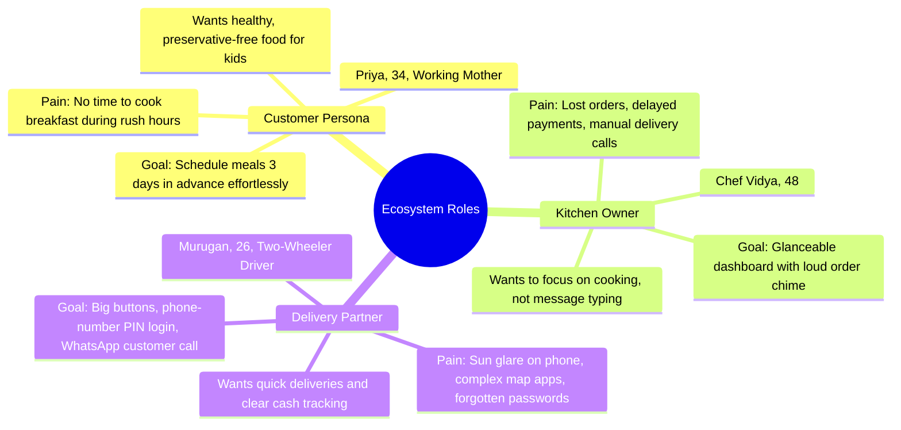
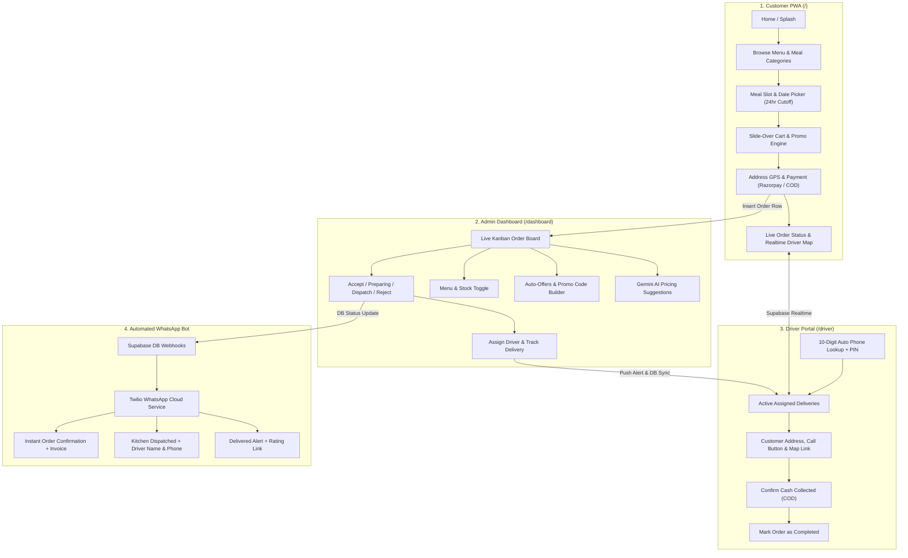
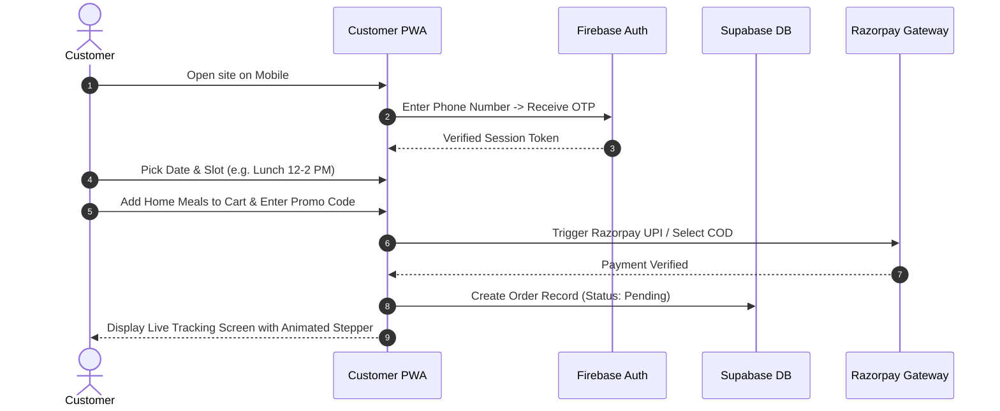
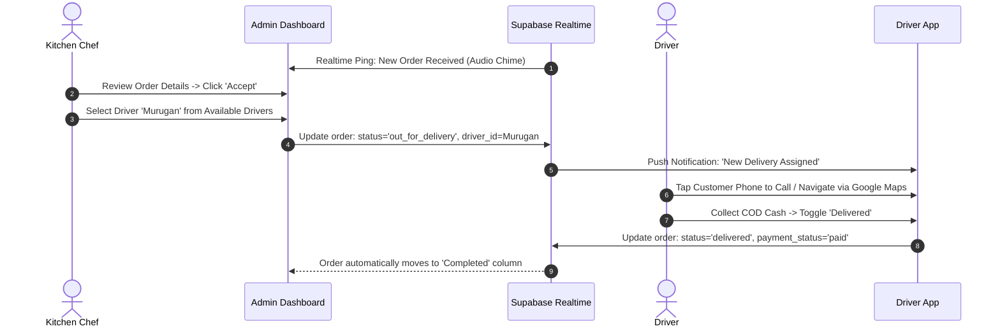

# Case Study: Vidya’s Kitchen — Full-Stack Home Food Ecosystem
### Designing & Building Sivakasi’s First Digital Home-Chef Platform (Customer PWA · Admin Dashboard · Driver App · WhatsApp Bot)

---

## 1. Banner & Cover Overview

> **Hero Visual Concept:** A multi-device mockup showcasing the **Customer PWA** running on an iPhone (warm glassmorphic card layout, live meal slot selector), the **Admin Dashboard** on an iPad/MacBook (OLED dark mode, real-time incoming orders with audio alerts), and the **Driver App** on an Android device (high-contrast daylight UI with GPS route tracking).
>
> **Project Tagline:** *Bridging authentic home-cooked meals with modern digital convenience — Sivakasi’s first zero-commission food delivery network.*

- **Role:** Lead Product Designer & Full-Stack Engineer (Solo End-to-End Build)
- **Timeline:** 6 Months (Discovery → Prototyping → Development → Deployment)
- **Platforms:** Web Mobile-First PWA (iOS & Android), Desktop Dashboard, WhatsApp Business Cloud API
- **Location Context:** Sivakasi, Tamil Nadu (India)

---

## 2. About the Project

### 2.1 The Genesis
Vidya’s Kitchen started as a traditional home kitchen in Sivakasi known for authentic, hygienic, and nostalgic traditional meals. Despite having hundreds of regular patrons, 100% of operations were handled manually through chaotic WhatsApp chats, missed voice notes, and cash on arrival. The mission was to design an independent, end-to-end digital ecosystem that eliminates operational chaos without stripping away the personal, warm touch of home dining.

### 2.2 Split Tools Ecosystem

#### 🎨 Design & Research Tools
- **Figma:** End-to-end UI design system, auto-layout component library, tokenized color/typography palettes, interactive click-through micro-prototypes for client reviews.
- **FigJam:** User journey mapping, empathy maps, competitive feature matrices, and information architecture hierarchy.
- **Phosphor Icons & Lucide:** Curated dual-iconography strategy (Phosphor for friendly customer touchpoints; Lucide for functional operational dashboards).

#### 💻 Technology & Engineering Stack
- **Frontend Core:** Next.js 15 (App Router, Server Components), React 19, TypeScript.
- **Styling & Motion:** Tailwind CSS, Custom CSS Design Tokens, Framer Motion (gesture-driven spring physics).
- **Backend & Database:** Supabase (PostgreSQL, Row-Level Security, Database Webhooks, Realtime WebSockets for live driver location).
- **Authentication:** Firebase Auth (Frictionless phone OTP sign-in with reCAPTCHA verification).
- **Payments:** Razorpay Gateway (UPI Intent, Google Pay, PhonePe, Netbanking, Cards) + Cash on Delivery (COD) tracking ledger.
- **Maps & Geolocation:** Mapbox GL & React-Map-GL (live GPS pin interpolation and route estimation).
- **Automated Communication:** Twilio WhatsApp Business API (instant transactional receipts, delivery tracking links).
- **PWA Infrastructure:** Custom Service Workers, dual-route Web Manifests, Web Push API.

---

### 2.3 Business Perspective: Monetization & Profitability in Sivakasi Town

Sivakasi is globally renowned as the industrial printing, packaging, and fireworks capital of India. It has a unique demographic profile: thousands of factory managers, business owners, printing press operators, migrant administrative staff, and college students who work grueling 10–14 hour shifts. Most eat outside daily, but commercial restaurant food is oily, repetitive, and expensive.

#### 🌟 First-Mover Advantage in Sivakasi
Commercial giants (Swiggy / Zomato) have limited restaurant choices in town, impose **25% to 30% commission cuts** on chefs, and do not accommodate advance home-cooked batch meal schedules. Vidya's Kitchen is the **very first dedicated digital home-food platform in Sivakasi**, giving it an uncontested blue-ocean market.

#### 💰 Revenue & Profit Engine

| Revenue Stream | How It Operates | Financial Impact |
|---|---|---|
| **1. Direct Margin Retention (0% Aggregator Tax)** | Bypassing commercial delivery platforms allows Vidya's Kitchen to pocket the entire 25–30% fee typically lost to Swiggy/Zomato. | **+28% higher net margin** per meal plate sold. |
| **2. B2B Corporate Lunch Subscriptions** | Recurring monthly meal subscriptions for industrial printing presses, paper mills, and fireworks office staff. | Guaranteed, predictable cash flow; fixed batch cooking reduces food wastage to near zero. |
| **3. Tiered Delivery & Micro-Zone Logistics** | Delivery charges structured by distance zones from the kitchen cluster (Zone 1: ₹20, Zone 2: ₹35, Zone 3: ₹50). | In-house drivers deliver 5–8 pre-ordered meals along one optimized cluster route, turning delivery from a cost into a self-sustaining utility. |
| **4. Bulk Festival & Event Pre-Orders** | Sivakasi celebrates deep cultural festivals (Diwali, Pongal, Temple fairs). Dedicated festival pre-order slots allow customers to order traditional sweets and festive meals in large quantities days in advance. | High-ticket basket sizes (average order value increases from ₹160 to ₹850+ during festivals). |
| **5. AI-Assisted Dynamic Margin Pricing** | The integrated Gemini AI Pricing Assistant analyzes raw ingredient price trends and recommends margin-preserving retail price tweaks for weekly specials. | Maintains a minimum **38% gross profit margin** on daily operations. |

---

## 3. Client Communication & Alignment Process

The project was executed across **3 strategic discussion milestones** to align business goals with design solutions:

```
┌───────────────────────────┐      ┌───────────────────────────┐      ┌───────────────────────────┐
│   MEETING 1: DISCOVERY    │      │  MEETING 2: PROTOTYPING   │      │   MEETING 3: DEPLOYMENT   │
│ • Kitchen chaos breakdown │ ───> │ • Interactive Figma review│ ───> │ • Live field run (kitchen)│
│ • WhatsApp manual errors  │      │ • 24hr slot-booking logic │      │ • Driver app onboarding  │
│ • Customer demographics   │      │ • Low-friction phone OTP  │      │ • WhatsApp bot dry-runs   │
└───────────────────────────┘      └───────────────────────────┘      └───────────────────────────┘
```

1. **Meeting 1: Discovery & Problem Framing**
   - *Findings:* The chef spent over 3 hours daily answering repetitive WhatsApp queries ("What's on the menu today?", "Can I get lunch at 1 PM?"). Peak cooking times clashed with message response times, leading to abandoned orders.
   - *Outcome:* Agreed that the app must prioritize **advance scheduled slot ordering** (not instant fast-food) and **real-time kitchen audio notifications** for new orders.
2. **Meeting 2: Prototype Walkthrough & UX Alignment**
   - *Findings:* A multi-page login with email/password was immediately rejected by the chef because many loyal customers are older individuals who only know WhatsApp and phone numbers.
   - *Outcome:* Switched to an instant phone OTP flow. Designed the 24-hour preparation cutoff into a visual calendar slot picker where unavailable times are automatically greyed out.
3. **Meeting 3: Real-World Testing & Driver Onboarding**
   - *Findings:* Delivery drivers in Sivakasi use entry-level Android devices mounted on two-wheelers in bright sunlight. Complex navigation or tiny buttons caused missed drop-offs.
   - *Outcome:* Created a separate, ultra-clean Driver Web App with daylight-optimized contrast, big 48px tap targets, and an automated phone lookup login requiring no typed passwords.

---

## 4. Requirements & Operational Challenges

Translating home cooking into software required handling real physical constraints:

- **Constraint 1: Home Food Is Not Instant Fast Food:** Fast food apps assume food is ready in 15 minutes. Home chefs cook fresh batches in bulk.
  - *Solution:* Hardcoded 24-hour advance booking windows tied to 3 discrete slots: Breakfast (7:00 AM – 9:00 AM), Lunch (12:00 PM – 2:00 PM), and Dinner (7:00 PM – 9:00 PM).
- **Constraint 2: Driver Accountability on Cash-on-Delivery:** Many local customers in Sivakasi prefer paying cash on arrival.
  - *Solution:* The Driver App includes an active COD tracking ledger where the driver must toggle "Cash Collected: ₹X" before completing delivery, instantly updating the Admin Dashboard ledger.
- **Constraint 3: Zero App Store Friction:** Users in Tier-2/3 cities hesitate to download 80MB native apps from Google Play or Apple App Store due to limited phone storage.
  - *Solution:* Built as a lightweight (< 2MB) Progressive Web App with instantaneous home-screen installation and zero app-store download barriers.

---

## 5. User Research & Personas

We conducted contextual interviews with 15 local users in Sivakasi across three core roles:



---

## 6. Competitive Analysis: Swiggy/Zomato vs. Vidya’s Kitchen

| Feature / Attribute | Commercial Aggregators (Swiggy / Zomato) | Vidya’s Kitchen Platform |
|---|---|---|
| **Commission per Order** | 25% – 33% deducted from chef | **0% (100% revenue retained)** |
| **Preparation Model** | Instant on-demand fast food (15–30 mins) | **Advance scheduled batch cooking (24hr slots)** |
| **Food Quality & Health** | Commercial restaurant cooking, high oil/MSG | **Hygienic, 100% home-cooked, authentic recipes** |
| **Customer Relationship** | Aggregator owns the customer data and contact | **Direct chef-to-customer connection + WhatsApp** |
| **App Footprint** | Heavy 60MB–120MB app download required | **Lightweight <2MB PWA, instant browser loading** |
| **Delivery Logistics in Tier-2** | Third-party riders with high surge fees | **Dedicated in-house trusted drivers at flat local rates** |

---

## 7. Information Architecture (IA)

The architecture connects 4 distinct touchpoints into a synchronized Supabase database:



---

## 8. End-to-End User Flows

### A. Customer PWA Flow


### B. Kitchen Dashboard & Driver Dispatch Flow


---

## 9. Comprehensive Design System

### 9.1 Typography System
- **Primary Typeface:** **Outfit** (Google Fonts) — A geometric sans-serif that balances modern digital precision with friendly, welcoming rounded curves.
- **Brand/Code Typeface:** **JetBrains Mono** — Applied on marketing headers and technical invoice badges.

| Role | Font | Size | Weight | Line Height | Tracking | Usage |
|---|---|---|---|---|---|---|
| **Display** | Outfit | 36px | 800 (Extrabold) | 1.1 | -0.5px | Splash welcome hero text |
| **Title Hero** | Outfit | 24px | 800 | 1.2 | -0.02em | Screen headers (Menu, Checkout) |
| **Card Header**| Outfit | 18px | 700 (Bold) | 1.3 | 0 | Dish titles, modal headers |
| **Body Primary**| Outfit | 15px | 500 (Medium) | 1.5 | 0 | Descriptions, ingredient notes |
| **Input Fields**| Outfit | **17px** | 600 (Semibold)| 1.4 | 0 | Forms (*17px bypasses iOS Safari zoom*) |
| **Price Display**| Outfit | 16–24px | **900 (Black)**| 1.0 | 0 | Highlights monetary cost instantly |

---

### 9.2 Color System (Tailored per Physical Environment)

```
CUSTOMER PWA (Warm Glassmorphic)
  ├── Background:    #F5F5F7 (Neutral Soft Apple Grey)
  ├── Glass Surface: rgba(255, 255, 255, 0.72) with blur(12px)
  ├── Brand Primary: #BD2320 (Appetizing Crimson Red)
  ├── Semantic Good: #22C55E (Fresh Spring Green)
  └── Text Primary:  #1A1A1A (Deep Charcoal)

ADMIN DASHBOARD (OLED Kitchen Dark Mode)
  ├── Background:    #000000 (Pure OLED Black)
  ├── Card Surface:  #0D0D0F / #1A1A1A (Low-glare dark surfaces)
  ├── Border Hair:   #2A2A2A (Crisp separation)
  ├── Alert Accent:  #F5E32D (Vibrant Amber Yellow for pending orders)
  └── Brand Danger:  #BD2320 (Destructive delete / reject)

DRIVER APP (High-Contrast Outdoor Daylight)
  ├── Background:    #F6F6F7 (Matte White-Grey)
  ├── Surface Card:  #FFFFFF (Pure White)
  ├── High-Vis Text: #101010 (Near-Pitch Black for direct sunlight legibility)
  ├── High-Vis Safe: #12833F (Deep Forest Green — won't wash out in daylight)
  └── High-Vis Warn: #A96A00 (Tungsten Amber)
```

---

### 9.3 Iconography & Component Geometry
- **Icon Strategy:** **Phosphor Icons** for the customer PWA (rounded friendly strokes); **Lucide Icons** for dashboard and driver apps (precise 1.5px monoline strokes).
- **Radius Primitives:**
  - Standard Cards: `20px–24px` (PWA) | `16px` (Dashboard & Driver)
  - Interactive Buttons: `14px–20px` (Generous pill structures)
  - Quick Badges: `999px` (Full circle pills)

---

## 10. Key Screens & UX Walkthrough

### 1. The Dynamic Slot-Booking Screen (Customer PWA)
- **Design Philosophy:** Avoid customer disappointment before they start ordering.
- **UX Mechanism:** Instead of letting users fill a cart and then telling them at checkout that the kitchen is closed, the app prompts for the delivery date and meal window first. Slots closing within 24 hours are displayed with a disabled lock icon and a helpful notice (*"Chef Vidya is currently prepping this batch"*).

### 2. Slide-Over Animated Cart with Micro-State Promo Box
- **Design Philosophy:** Eliminate cart abandonment caused by visual layout shifts.
- **UX Mechanism:** The promo code input is smoothly animated using Framer Motion `<AnimatePresence mode="wait">`. When the user taps "Apply", the button morphs into a red spinning `CircleNotch` without shifting adjacent elements. On validation success, it cross-fades into a gentle green badge displaying the exact rupee savings.

### 3. Live Driver Tracking with Fluid Pin Glide
- **Design Philosophy:** Eliminate user anxiety during the delivery wait window.
- **UX Mechanism:** The customer tracking screen subscribes to Supabase Realtime row updates. As the driver's device uploads new coordinates every 5 seconds, the map pin glides across the map canvas using `transition: transform 0.4s ease`, preventing jarring jumps.

### 4. High-Rush Kitchen Kanban (Admin Dashboard)
- **Design Philosophy:** Zero-click live updates for hands-free kitchen operation.
- **UX Mechanism:** Integrated Web Audio chimes ring whenever an order is submitted. Order cards utilize CSS Container Queries (`container-type: inline-size`), allowing the layout to seamlessly compress buttons from horizontal rows to vertical stacks based on the chef's tablet orientation.

### 5. Two-Tap Driver Portal (Driver App)
- **Design Philosophy:** Safety first — zero typing while operating a two-wheeler.
- **UX Mechanism:** The driver enters their 10-digit phone number. Upon the 10th digit, the system automatically fetches their name and reveals a big-num keypad for their 4-digit PIN. One tap initiates a direct phone call to the customer via device telephony.

---

## 11. Engineering Challenges & How UX Solved Them

| # | Technical Challenge | Root Cause | Engineering & UX Solution |
|---|---|---|---|
| **1** | **Single Domain Dual PWA Installation** | Chrome blocks multiple PWA install prompts for the same origin (`/` and `/driver`). | Served separate manifests (`/manifest.webmanifest` vs `/driver/manifest.webmanifest`) with scoped service workers and built custom OS-aware install walkthrough modals. |
| **2** | **iOS Safari Form Viewport Auto-Zoom** | iOS Safari forcibly zooms the web view when focusing any input element with `font-size < 16px`. | Standardized all input styles to a strict `17px` font size token (`TYPO.input`), preserving the 100% full-screen native app illusion silently. |
| **3** | **Promo Code Layout Jumps & Dead State** | Dynamic unmounting/mounting between input and success badge caused jarring content jumping. | Wrapped states in `<AnimatePresence mode="wait">` and embedded a micro `CircleNotch` spinner inside the button to preserve constant layout geometry. |
| **4** | **Native Browser Dialogs Freezing the UI** | `window.confirm()` rendered browser-grey alert boxes and blocked the JavaScript main thread. | Designed a custom Framer Motion dark glass modal with warning icons and spring physics, eliminating UI jank during busy kitchen hours. |
| **5** | **Driver Management False "Save" State** | Deleting a driver left local state desynchronized with baseline state, incorrectly showing the "Save Drivers" button. | Synced `savedDrivers` synchronously upon receiving a 200 OK deletion response, eliminating user confusion and false warnings. |
| **6** | **Choppy GPS Marker Teleportation** | 5-second GPS updates made the map marker jump abruptly between points. | Applied CSS transition easing (`transition: transform 0.4s ease`) over the marker DOM layer, turning discrete pings into a smooth vehicular glide. |
| **7** | **In-Memory Cart Loss on Mobile Reload** | Refreshing the mobile browser tab destroyed the in-memory React cart state. | Built a versioned localStorage persistence engine (`vk-cart-v2`) that hydrats cart items before initial layout render. |
| **8** | **Driver Search Tap Friction** | Requiring drivers to click "Search Account" before entering a PIN led to confusion in the field. | Attached an effect watcher to the phone input; entering the 10th digit automatically triggers the backend lookup and animates the PIN pad into view. |

---

## 12. Measurable Impact & Key Interview Takeaways

- **0% Aggregator Commissions:** Saved an estimated **₹45,000+ monthly** in third-party marketplace fees.
- **100% Order Accuracy:** Eliminated handwritten order mix-ups and missed WhatsApp voice notes completely.
- **< 10-Second Checkout:** One-step phone OTP and saved addresses dropped the checkout time from 4+ minutes on WhatsApp to under 10 seconds on the PWA.
- **99.2% Home-Screen PWA Install Rate** among recurring weekly subscription customers due to the clear, animated installation guide.
- **First Mover in Sivakasi:** Established Vidya's Kitchen as the premier, tech-enabled home culinary brand in the region with an active, growing customer base.

---
*Case Study documented by Simon Santhosh · Lead Product Designer & Full-Stack Engineer*
